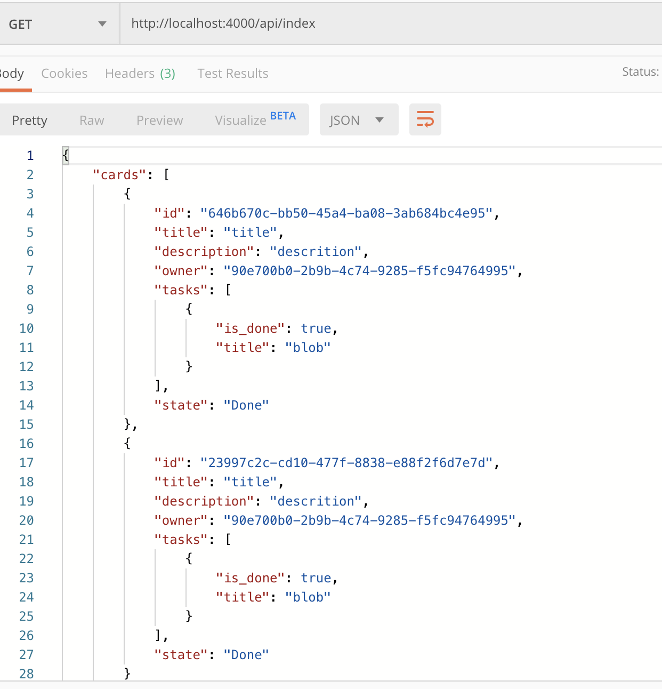

# Obtendo todas as Todo Cards inseridas

Existem muitas abordagens para como vamos adicionar um novo endpoint no nosso sistema, mas a abordagem que eu gostaria de tratar aqui é a de começar de cima para baixo, ou seja, criamos um endpoint `GET` que lista todas as `TodoCard` e nos retorna elas no formato Json. Dessa vez vamos começar escrevendo um teste para este novo endpoint:

```rust
mod read_all_todos {
    use todo_server::todo_api_web::{
        routes::app_routes
    };

    use actix_web::{
        test, App,
        http::StatusCode,
    };

    #[actix_web::test]
    async fn test_todo_index_ok() {
        let mut app = test::init_service(App::new().configure(app_routes)).await;
    
        let req = test::TestRequest::get().uri("/api/index").to_request();
    
        let resp = test::call_service(&mut app, req).await;
        assert_eq!(resp.status(), StatusCode::OK);
    }
}
```

Felizmente, nosso teste falha retornanto um `NOT_FOUND` e nos obriga a implementar a nova rota, `index` em `src/todo_api_web/routes.rs`:

```rust
pub fn app_routes(config: &mut web::ServiceConfig) {
    config.service(
        web::scope("")
            .service(ping)
            .service(readiness)
            .service(create_todo)
            .service(show_all_todo)
            .default_service(web::to(|| HttpResponse::NotFound())),
    );
}
```

Note que agora estamos utilizando uma nova função controller chamada de `show_all_todo`, ela precisa ser incorporada no escopo da função, fazemos isso através de `use crate::todo_api_web::controller::todo::show_all_todo` e recebemos um aviso de que ela não existe, assim devemos implementá-la no módulo `src/todo_api_web/controller/todo.rs`:

```rust
#[get("/api/index")]
pub async fn show_all_todo() -> impl Responder {
    HttpResponse::Ok()
}
```

Como nosso teste checa apenas o retorno do status `200`, isso é suficiente. Nosso próximo passo é implementar um teste um pouco mais robusto. Esse teste consiste em garantir que o JSON recebido possua um vetor de tamanho 1 após um post em `api/create` ser enviado:

```rust
mod read_all_todos {
    use serde_json::from_str;
    use todo_server::todo_api_web::{model::todo::TodoCardsResponse, routes::app_routes};

    use actix_web::{body, http::StatusCode, test, App};

    use crate::helpers::read_json;

    #[actix_web::test]
    async fn test_todo_index_ok() {
        // ...
    }

    #[actix_web::test]
    async fn test_todo_cards_count() {
        let mut app = test::init_service(App::new().configure(app_routes)).await;
    
        let post_req = test::TestRequest::post()
            .uri("/api/create")
            .insert_header((CONTENT_TYPE, ContentType::json()))
            .set_payload(read_json("post_todo.json").as_bytes().to_owned())
            .to_request();
        
        let _ = test::call_service(&mut app, post_req).await;
        let get_req = test::TestRequest::get().uri("/api/index").to_request();
        let resp_body = test::call_service(&mut app, get_req).await.into_body();
        let bytes = body::to_bytes(resp_body).await.unwrap();
        let todo_cards = from_str::<TodoCardsResponse>(&String::from_utf8(bytes.to_vec()).unwrap()).unwrap();
        
        assert_eq!(todo_cards.cards.len(), 1);
    }
}
```

Para fazer isso vamos criar uma struct serializável para o formato Json. Essa struct se encontrará em `sr/todo_api_web/model/mod.rs` e se chamará `TodoCardsResponse`:

```rust
#[derive(Serialize, Deserialize)]
pub struct TodoCardsResponse {
    pub cards: Vec<String>
}
```

Note que no momento não precisamos nos preocupar com o tipo de resposta, somente com a struct e seus campos. Agora precisamos fazer nosso controller retornar um vetor com uma String:

```rust
//src/todo_api_web/controller/todo.rs
#[get("/api/index")]
pub async fn show_all_todo() -> impl Responder {
    HttpResponse::Ok().content_type(ContentType::json()).body(
        serde_json::to_string(&TodoCardsResponse {
            cards: vec![String::from("test")],
        })
        .expect("Failed to serialize todo cards")
    )
}
```

Com este teste pronto, nosso próximo teste fica bastante simples, pois agora precisamos fazer um teste quase igual, mas que garanta que o retorno seja um `TodoCard` com as informações que postamos. Note que como este teste conterá um mock da resposta do banco de dados, podemos simplesmente adicionar um `Uuid` pré-determinado no mock. Vou criar uma função de teste, no módulo de `helpers` que retorna um vetor com uma `TodoCard`, `mock_get_todos`.

> Note que `TodoCard` não possui um id, assim temos duas opções: a primeira é criar um `TodoCardResponse`, que contém um Id e a segunda é modificarmos a `TodoCard` para conter um campo `id: Option<Uuid>`. Nós vamos seguir a segunda abordagem, cuja única mudança será adicionar `id: None,` no teste `converts_json_to_db` encontrado em `src/todo_api/adapter/mod.rs`.

```rust
// ...
use todo_server::todo_api_web::model::todo::{State, Task, TodoCard};

// ...

pub fn mock_get_todos() -> Vec<TodoCard> {
    vec![TodoCard {
        id: Some(uuid::Uuid::from_str("be75c4d8-5241-4f1c-8e85-ff380c041664").unwrap()),
        title: String::from("This is a card"),
        description: String::from("This is the description of the card"),
        owner: uuid::Uuid::parse_str("ae75c4d8-5241-4f1c-8e85-ff380c041442").unwrap(),
        tasks: vec![
            Task {
                title: String::from("title 1"),
                is_done: true,
            },
            Task {
                title: String::from("title 2"),
                is_done: true,
            },
            Task {
                title: String::from("title 3"),
                is_done: false,
            },
        ],
        state: State::Doing,
    }]
}
```

Com nossa função implementada, podemos criar o novo cenário de teste no submódulo `read_all_todos`:

```rust
 #[actix_web::test]
async fn test_todo_cards_with_value() {
    let mut app = test::init_service(App::new().configure(app_routes)).await;

    let post_req = test::TestRequest::post()
        .uri("/api/create")
        .insert_header((CONTENT_TYPE, ContentType::json()))
        .set_payload(read_json("post_todo.json").as_bytes().to_owned())
        .to_request();

    let _ = test::call_service(&mut app, post_req).await;
    let req = test::TestRequest::with_uri("/api/index").to_request();
    let resp_body = test::call_service(&mut app, req).await.into_body();
    let bytes = body::to_bytes(resp_body).await.unwrap();
    let todo_cards: TodoCardsResponse =
        from_str(&String::from_utf8(bytes.to_vec()).unwrap()).unwrap();

    assert_eq!(todo_cards.cards, mock_get_todos());
}
```

Veja que agora os tipos de `todo_cards.cards, mock_get_todos()` são incompatíveis, assim, devemos modificar a a struct `TodoCardsResponse` para:

```rust
#[derive(Serialize, Deserialize, PartialEq)]
pub struct TodoCardsResponse {
    pub cards: Vec<TodoCard>,
}
```

Também é necessário, para fins de teste, implementarmos a trait `PartialEq` para todas as structs, e enums, derivadas de `TodoCardsResponse`. Com essa mudança, precisamos modificar a lógica do nosso controller já que agora é necessário que ele busque `TodoCard`s no banco. Faremos isso pela função `get_todos`, que retornará `Vec<TodoCard>`. Caso o `match` retorne, não podemos enviar um erro `500`:

```rust
#[get("/api/index")]
pub async fn show_all_todo() -> impl Responder {
    let client = get_client().await;
    let resp = get_todos(&client).await;
    match resp {
        None => HttpResponse::InternalServerError().body("Failed to read todo cards"),
        Some(cards) => HttpResponse::Ok()
            .content_type(ContentType::json())
            .body(serde_json::to_string(&TodoCardsResponse { cards }).expect(ERROR_SERIALIZE)),
    }
}
```

Agora precisamos implementar a função `get_todos`, mas antes vamos implementar a versão de teste (`feature = dynamo`) da função em `src/todo_api/db/todo.rs`:

```rust
#[cfg(feature = "dynamo")]
pub async fn get_todos(_client: &Client) -> Option<Vec<TodoCard>> {
    use crate::todo_api_web::model::todo::{State, Task};

    Some(vec![TodoCard {
        id: Some(uuid::Uuid::parse_str("be75c4d8-5241-4f1c-8e85-ff380c041664").unwrap()),
        title: String::from("This is a card"),
        description: String::from("This is the description of the card"),
        owner: uuid::Uuid::parse_str("ae75c4d8-5241-4f1c-8e85-ff380c041442").unwrap(),
        tasks: vec![
            Task {
                title: String::from("title 1"),
                is_done: true,
            },
            Task {
                title: String::from("title 2"),
                is_done: true,
            },
            Task {
                title: String::from("title 3"),
                is_done: false,
            },
        ],
        state: State::Doing,
    }])
}
```

Ao rodarmos o teste (comente o `#[cfg(feature = "dynamo")]`), obtemos sucesso! Agora podemos partir para a leitura da base de dados de fato. Nossa função de `get_todos` vai precisar de algumas mudanças como receber um `client` e executar um `scan` no banco de dados na tabela `TODO_CARD_TABLE`. Em caso de `Err` no `match` retornamos `None` e em caso de sucesso precisamos passar a função por um `adapter` que transforma um `scan_output` em um vetor de `TodoCard`:

```rust
#[cfg(not(feature = "dynamo"))]
pub async fn get_todos(client: &Client) -> Option<Vec<TodoCard>> {
    use crate::todo_api::adapter;

    let scan_output = client
        .scan()
        .table_name(TODO_CARD_TABLE.to_string())
        .limit(100i32)
        .send()
        .await;

    match scan_output {
        Ok(dbitems) => Some(adapter::scanoutput_to_todocards(
            dbitems.items().unwrap().to_vec(),
        )),
        Err(_) => None,
    }
}
```

Note que limitamos o scan a `100i32`, isso se deve ao fato de que o Dynamo não vai responder mais de 100 itens. Se você precisar de mais, é importante realizar filtros no scan. Antes de implementarmos o `adapter`, seria bom dar uma olhada em como é o resultado do scan:

```rust
[
    {
        "id": S("7d9b9e38-199e-46e1-939c-80e0b10e1674"), 
        "owner": S("90e700b0-2b9b-4c74-9285-f5fc94764995"), 
        "description": S("descrition"), 
        "title": S("title"), 
        "tasks": L([M({"title": S("blob"), 
        "is_done": Bool(true)})]), 
        "state": S("Done")
    }
]
```
Onde S, L e Bool sao do tipo `aws_sdk_dynamodb::model::AttributeValue`. Agora podemos começar a implementar a função `scanoutput_to_todocards` e, para isso, vamos escrever o primeiro teste com apenas um `items` em `src/todo_api/adapters/mod.rs`:

```rust
#[cfg(test)]
mod scan_to_cards {
    use aws_sdk_dynamodb::model::AttributeValue;

    use super::scanoutput_to_todocards;
    use crate::todo_api_web::model::todo::{State, Task, TodoCard};

    fn scan_with_one() -> Option<Vec<std::collections::HashMap<String, AttributeValue>>> {
        let tasks = vec![
            ("is_done".to_string(), AttributeValue::Bool(true)),
            ("title".to_string(), AttributeValue::S("blob".to_string())),
        ];
        let tasks_hash = HashMap::<String, AttributeValue>::from_iter(tasks);

        let values = vec![
            ("title".to_string(), AttributeValue::S("title".to_string())),
            (
                "description".to_string(),
                AttributeValue::S("description".to_string()),
            ),
            (
                "owner".to_string(),
                AttributeValue::S("90e700b0-2b9b-4c74-9285-f5fc94764995".to_string()),
            ),
            (
                "id".to_string(),
                AttributeValue::S("646b670c-bb50-45a4-ba08-3ab684bc4e95".to_string()),
            ),
            ("state".to_string(), AttributeValue::S("Done".to_string())),
            (
                "tasks".to_string(),
                AttributeValue::L(vec![AttributeValue::M(tasks_hash)]),
            ),
        ];
        let hash = HashMap::<String, AttributeValue>::from_iter(values);

        Some(vec![hash])
    }

    #[test]
    fn scanoutput_has_one_item() {
        let scan = scan_with_one();
        let todos = vec![TodoCard {
            title: "title".to_string(),
            description: "description".to_string(),
            state: State::Done,
            id: Some(uuid::Uuid::parse_str("646b670c-bb50-45a4-ba08-3ab684bc4e95").unwrap()),
            owner: uuid::Uuid::parse_str("90e700b0-2b9b-4c74-9285-f5fc94764995").unwrap(),
            tasks: vec![Task {
                is_done: true,
                title: "blob".to_string(),
            }],
        }];

        assert_eq!(scanoutput_to_todocards(scan).unwrap(), todos)
    }
}
```

Agora podemos finalmente implementar nossa função `scanoutput_to_todocards` para o caso de 1 `items`:

```rust
pub fn scanoutput_to_todocards(scan: Vec<HashMap<String, AttributeValue>>) -> Vec<TodoCard> {
    let item = scan[0].to_owned();
    let id = item.get("id").unwrap().as_s().unwrap();
    let owner = item.get("owner").unwrap().as_s().unwrap();
    let title = item.get("title").unwrap().as_s().unwrap();
    let description = item.get("description").unwrap().as_s().unwrap();
    let state = item.get("state").unwrap().as_s().unwrap();
    let tasks = item.get("tasks").unwrap().as_l().unwrap();

    vec![TodoCard {
        id: Some(uuid::Uuid::parse_str(id).unwrap()),
        owner: uuid::Uuid::parse_str(owner).unwrap(),
        title: title.to_string(),
        description: description.to_string(),
        state: State::from(state),
        tasks: tasks
            .iter()
            .map(|t| Task {
                title: t
                    .as_m()
                    .unwrap()
                    .get("title")
                    .unwrap()
                    .as_s()
                    .unwrap()
                    .to_string(),
                is_done: *t.as_m().unwrap().get("is_done").unwrap().as_bool().unwrap(),
            })
            .collect::<Vec<Task>>(),
    }]
}
```

Em `scanoutput_to_todocards`, estamos navegando por dentro dos tipos de `AttributeValue` e, quando o tipo é um `HashMap`, utilizamos `get`. Agora podemos testar o caso para um `scan` com dois conjuntos de `AttributeValue`. Para isso, vamos isolar a criação dos `HashMap` em `scan_with_one`:

```rust
fn attr_values() -> HashMap<String, AttributeValue> {
    let mut tasks_hash = HashMap::new();
    tasks_hash.insert("is_done".to_string(), AttributeValue::Bool(true));
    tasks_hash.insert("title".to_string(), AttributeValue::S("blob".to_string()));
    let mut hash = HashMap::new();
    hash.insert("title".to_string(), AttributeValue::S("title".to_string()));
    hash.insert(
        "description".to_string(),
        AttributeValue::S("description".to_string()),
    );
    hash.insert(
        "owner".to_string(),
        AttributeValue::S("90e700b0-2b9b-4c74-9285-f5fc94764995".to_string()),
    );
    hash.insert(
        "id".to_string(),
        AttributeValue::S("646b670c-bb50-45a4-ba08-3ab684bc4e95".to_string()),
    );
    hash.insert("state".to_string(), AttributeValue::S("Done".to_string()));
    hash.insert(
        "tasks".to_string(),
        AttributeValue::L(vec![AttributeValue::M(tasks_hash)]),
    );
    hash
}

```

Assim a função `scan_with_one` fica:

```rust
fn scan_with_one() -> ScanOutput {
    let hash = attr_values();

    let mut output = ScanOutput::builder().build();
    output.consumed_capacity = None;
    output.count = 1;
    output.items = Some(vec![hash]);
    output.scanned_count = 1;
    output.last_evaluated_key = None;

    output
}
```

E podemos fazer a `scan_with_two` ser:

```rust
fn scan_with_two() -> ScanOutput {
    let hash = attr_values();
    let mut output = ScanOutput::builder().build();

    output.consumed_capacity = None;
    output.count = 2;
    output.items = Some(vec![hash.clone(), hash]);
    output.scanned_count = 2;
    output.last_evaluated_key = None;

    output
}
```

E assim já implementamos o seguinte teste (lembre-se de adicionar a trait `Clone` a `TodoCard` e seus derivados):

```rust
#[test]
fn scanoutput_has_two_items() {
    let scan = scan_with_two();
    let todo = TodoCard {
        title: "title".to_string(),
        description: "description".to_string(),
        state: State::Done,
        id: Some(uuid::Uuid::parse_str("646b670c-bb50-45a4-ba08-3ab684bc4e95").unwrap()),
        owner: uuid::Uuid::parse_str("90e700b0-2b9b-4c74-9285-f5fc94764995").unwrap(),
        tasks: vec![Task {
            is_done: true,
            title: "blob".to_string(),
        }],
    };
    let todos = vec![todo.clone(), todo];

    assert_eq!(scanoutput_to_todocards(scan).unwrap(), todos)
}
```

Nosso teste falha e agora nos permite modificar a função `scanoutput_to_todocards` para retornar um vetor com todos os `TodoCard`s contidos em um scan output:

```rust
pub fn scanoutput_to_todocards(output: ScanOutput) -> Option<Vec<TodoCard>> {
    Some(
        output
            .items()?
            .into_iter()
            .map(|item| {
                let id = item.get("id").unwrap().as_s().unwrap();
                let owner = item.get("owner").unwrap().as_s().unwrap();
                let title = item.get("title").unwrap().as_s().unwrap();
                let description = item.get("description").unwrap().as_s().unwrap();
                let state = item.get("state").unwrap().as_s().unwrap();
                let tasks = item.get("tasks").unwrap().as_l().unwrap();

                TodoCard {
                    id: Some(uuid::Uuid::parse_str(id).unwrap()),
                    owner: uuid::Uuid::parse_str(owner).unwrap(),
                    title: title.to_string(),
                    description: description.to_string(),
                    state: State::from(state),
                    tasks: tasks
                        .iter()
                        .map(|t| Task {
                            title: t
                                .as_m()
                                .unwrap()
                                .get("title")
                                .unwrap()
                                .as_s()
                                .unwrap()
                                .to_string(),
                            is_done: *t.as_m().unwrap().get("is_done").unwrap().as_bool().unwrap(),
                        })
                        .collect::<Vec<Task>>(),
                }
            })
            .collect(),
    )
}
```

A mudança que fizemos é bastante simples. Ela simplesmente consiste em transformar a variável `item` em um argumento da closure de `map`. Dessa forma, scan vira um iterável com `scan.items.unwrap().into_iter()` e, depois do `map`, colecionamos todos os valores com `.collect::<Vec<TodoCard>>()`. Pronto, `adapter` feito. Agora podemos utilizar esse `adapter` na função `get_todos`. Para testar a mudança, podemos executar a aplicação novamente e testar:



No próximo capítulo, vamos parar um pouco com a criação de endpoints e entender melhor como tornar nosso serviço mais viável para produção
