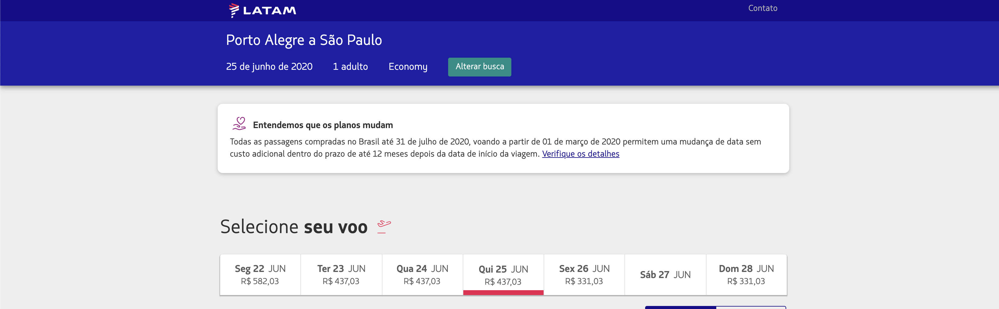
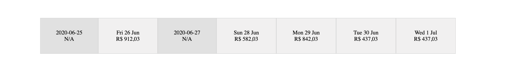

# Componente de Best Prices

Vamos começar com o código que corresponde ao componente de Best Prices, aquele que é o carrossel de preços na parte da imagem a seguir.



## Fazendo o request para para nosso serviço da parte 2

A primeira coisa que precisamos fazer para podermos utilizar os dois serviços (frontend e backend) em `localhost` é implementar um sistema de CORS no serviço GraphQL que fizemos anteriormente. Essa mudanca é bastante simples e impacta muito pouco na estrutura do código. O que vamos fazer é adicionar a crate `actix-cors` no `Cargo.toml`:

```toml
[package]
name = "recommendations-gql"
version = "0.1.0"
authors = ["Julia Naomi <jnboeira@outlook.com>"]
edition = "2018"

# See more keys and their definitions at https://doc.rust-lang.org/cargo/reference/manifest.html

[dependencies]
actix-web = "2.0.0"
# ...
redis = "0.16.0"
actix-cors = "0.2.0"

[dev-dependencies]
bytes = "0.5.3"
```

Agora no arquivo `main.rs` precisamos adicionar as configurações de CORS, para isso disponibilizamos `Cors` através da diretiva `use actix_cors::Cors;` e dentro da função `main` criamos o recurso de `Cors` envolto em um `wrap` com:

```rust
#[actix_rt::main]
async fn main() -> std::io::Result<()> {
    let resolvers: std::sync::Arc<Resolver> = std::sync::Arc::new(create_resolver());

    HttpServer::new(move || {
        App::new()
            .data(resolvers.clone())
            .wrap(
                Cors::new()
                    // ...
                    .finish(),
            )
            .configure(routes)
            .default_service(web::to(|| async { "404" }))
    })
    .bind("127.0.0.1:4000")?
    .run()
    .await
}
```

Agora precisamos configurar quais domínios, métodos e headers serão adicionados. Existem duas maneiras de fazer isso, a primeira e mais simples é atraveés da função `supported_credentials`:

```rust
App::new()
    .data(resolvers.clone())
    .wrap(
        Cors::new()
            .supports_credentials()
            .max_age(3600)
            .finish(),
    )
    .configure(routes)
    .default_service(web::to(|| async { "404" }))
```

E a segunda é adicionando explicitamente as informações com as funções `allowed_*`. Vamos utilizar esta abordagem:

```rust
App::new()
    .data(resolvers.clone())
    .wrap(
        Cors::new()
            .allowed_origin("http://localhost:8080")
            .allowed_origin("http://127.0.0.1:8080")
            .allowed_origin("http://0.0.0.0:8080")
            .allowed_methods(vec!["GET", "POST"])
            .allowed_headers(vec![header::AUTHORIZATION, header::ACCEPT])
            .allowed_header(header::CONTENT_TYPE)
            .max_age(3600)
            .finish(),
    )
    .configure(routes)
    .default_service(web::to(|| async { "404" }))
```

Agora basta executar um `make redis` e depois um `make run` e esse serviço estará executando.

### Printando o request

O passo mais básico que podemos fazer com um request é printar sua resposta na tela. Não precisamos de nenhum estilo bonito ou organização neste ponto, serve somente para sabermos que o request foi bem sucedido. Para fazermos isso, podemos começar pensando como será nossa `view`. Atualmente nossa `view` está com a seguinte aparência:

```rust
fn view(&self) -> Html {
    html! {
        <div>
            <p>{ "Hello world!" }</p>
            <p>{ "Hello Julia" }</p>
        </div>
    }
}
```

Mas se vamos fazer um request precisaremos de um booleano que indica o estado de `loading` e uma `String` que representa a resposta do do backend GraphQL:

```rust
fn view(&self) -> Html {
    if self.fetching {
        html! {
            <div class="loading">
                {"Loading..."}
            </div>
        } 
    } else {
        html! {
            <div>
                <p>{ 
                    if let Some(data) = &self.graphql_response {
                        data
                    } else {
                        "Failed to fetch"
                    }
                }</p>
            </div>
        }
    }
}
```

Assim, defini as duas propriedades da struct `Airline` são `fetching` que indica que um request está sendo feito e `graphql_response` que corresponde ao corpo da resposta do GraphQL. Nosso `view` possui duas modalidades definidas pelo `if/else`, caso o `self.fetching` seja `true` vamos exibir o texto `Loading...` no HTML, que podemos construir utilizando a macro `html!` e injetando o HTML correspondente os q desejamos executar, no caso `html! {<div class="loading">{"Loading..."}</div>}`. Já no nosso `else` utilizamos a macro `html!` da mesma forma, mas decidimos o que exibir com base no `if-let` que extrai o campo `Option` de  `graphql_response`. Com isso, podemos começar a implementar a struct `Airline` e implementar a função `create` que vai definir os valores iniciais de cada propriedade:

```rust
use yew::prelude::*;
// ...


pub struct Airline {
    // ...
    fetching: bool,
    graphql_response: Option<String>
}

pub enum Msg {
    // ..
    Fetching(bool)
}

impl Component for Airline {
    type Message = Msg;
    type Properties = ();

    fn create(_: Self::Properties, link: ComponentLink<Self>) -> Self {
        Airline {
            // ...
            fetching: false,
            graphql_response: None
        }
    }
    // ...
}
```

Note que a função `create` pertence a trait `Component`, que equivale as funções básicas do React. E o enum `Msg` do tipo `Message` funciona de forma que para cada mensagem enviada uma ação é tomada, o que explica os dois estados do `if/else` reagindo diferentemente ao `self.fetching`, que é recebido pela opção `Msg::Fetching` que recebe um `bool`. Esta funcionalidade de atualizar o estado pertence a função `update` da trait `Component`.  Já a função `update` tem a seguinte aparência:

```rust
impl Component for Airline {
    type Message = Msg;
    type Properties = ();
    // ...
    fn update(&mut self, msg: Self::Message) -> ShouldRender {
        match msg {
            // ...
            Msg::Fetching(fetch) => {
                self.fetching = fetch;
            }
        }
        true
    }
}
```

Na função `update` para cada opção de `Msg` o match toma uma ação. Outra função importante nesse contexto é a função `create` que funciona de forma a atualizar a `view` em caso de alguma propriedade mudar:

```rust
impl Component for Airline {
    type Message = Msg;
    type Properties = ();

    // ...
    fn change(&mut self, _: <Self as yew::html::Component>::Properties) -> bool { 
        false
    }
}
```

Na função `change`, se alguma propriedade mudar, é preciso retornar `true`, e se nada acontecer retornar `false`. Com isso, falamos de todas as funções de implementação obrigatória da trait `Component`, mas ainda temos uma função extra que podemos utilizar para nossa aplicação, a `rendered`, que corresponde ao `componentDidMount` do React, e ela é aplicada de forma diferente para o primeiro `render`:

```rust
fn rendered(&mut self, first_render: bool) {
    if first_render {
        Msg::Fetching(true);
        self.fetch_data(); 
    }
}
```

Para o primeiro `render` atualizamos o estado de `fetching` para true com `Msg::Fetching(true)` para que possamos exibir `Loading...` na `view`:

```rust
fn view(&self) -> Html {
    if self.fetching {
        html! {
            <div class="loading">
                {"Loading..."}
            </div>
        } 
    } 
    // ...
}
```

Depois disso, temos a função que executa o `fetch` em si, `self.fetch_data()`. Para essa função vamos precisar de um novo `impl` que nos permita acessar o `self` de `Airline`:

```rust
use crate::gql::fetch_gql;

impl Airline {
    pub fn fetch_data(&mut self) {
        let request = fetch_gql();
  
          let callback = self.link.callback(
              move |response: Response<Text>| {
                  let (meta, data) = response.into_parts();
                  if meta.status.is_success() {
                      Msg::FetchGql(Some(data))
                  } else {
                      Msg::FetchGql(None)
                  }
              },
          );
  
          let request = Request::builder()
              .method("POST")
              .header("content-type", "application/json")
              .uri(self.graphql_url.clone())
              .body(Json(&request))
              .unwrap();

          let task = self.fetch.fetch(request, callback).unwrap();
          self.fetch_task = Some(task);
          Msg::Fetching(false);
    }
}
```

Primeiro passo de `fetch_data` é função da `fetch_gql` do módulo `gql`, que retorna o Json para executar a query no serviço, que depende da crate `serde_json`:

```rust
use serde_json::{json, Value};

pub fn fetch_gql() -> Value {
    json!({
        "query": "{
             bestPrices(departure: \"2020-07-21\", origin: \"POA\", destination: \"GRU\") {
                bestPrices {
                    date
                    available
                    price {amount}
                }
             }
        }"
    })
}
```

Em seguida, encontramos `self.link`, um novo tipo a ser adicionado a nossa struct `Airline`, que é do tipo `ComponentLink<Self>`, cuja principal função é fazer callback. No nosso caso, esses callback processam a resposta da requisição, `response`, separam a resposta através da funçnao `into_parts` em metadados, `meta`, e em corpo, `data` para executar um pattern matching dos valores. Se a requisição retornou `2xx`, através da função `meta.status.is_success()`, enviamos a mensagem `Msg::FetchGql(Some(data))`, senão enviamos a mensagem `Msg::FetchGql(None)`.

O próximo passo é montar a requisição com `yew::services::fetch::Request::builder()`, na qual definimos o método com `method("POST")`, os `headers`, a `url` já salva em `self.graphql_url` e o corpo do request em `body`, que é o tipo `Value` retornado em `let request = fetch_gql();` transformado em Json através da função `Json()`. Por último definimos o `fetch` com seu `request` e seu `callback`, `fetch(request, callback)` e passamos seu resultado para `FetchTask` definida em `self.fetch_task`, que executará o fetch:

```rust
let task = self.fetch.fetch(request, callback).unwrap();
self.fetch_task = Some(task);
```

Para então definirmos que `fetching` é false em `Msg::Fetching(false)`. Agora precisamos adicionar os novos tipos de dados presentes em nossa struct `Airline`:

```rust
use yew::prelude::*;
use yew::services::{
    fetch::{FetchService, FetchTask, Request, Response}
};
use yew::format::{Text, Json};
use crate::gql::fetch_gql;


pub struct Airline {
    fetch: FetchService,
    link: ComponentLink<Self>,
    fetch_task: Option<FetchTask>,
    fetching: bool,
    graphql_url: String,
    graphql_response: Option<String>
}


impl Airline {
    pub fn fetch_data(&mut self) {
        // ...    
    }
}

pub enum Msg {
    FetchGql(Option<Text>),
    Fetching(bool)
}

impl Component for Airline {
    type Message = Msg;
    type Properties = ();

    fn create(_: Self::Properties, link: ComponentLink<Self>) -> Self {
        Airline {
            fetch: FetchService::new(),
            link: link,
            fetch_task: None,
            fetching: true,
            graphql_url: "http://localhost:4000/graphql".to_string(),
            graphql_response: None
        }
    }
    // ...
}
```

Para cada um dos campos:
* `fetch: FetchService`: `FetchService` é a struct com conhecimentos de como realizar um Fetch via WebAssembly, algo como o `fetch` em JavaScript. Para inicializar este valor basta executar `FetchService::new()`.
* `link: ComponentLink<Self>`: como já falamos é responsável por fazer as conexões do `Component` com `callbacks`. É inicializado com pelo próprio `Component`.
* `fetch_task: Option<FetchTask>`: é basicamente um handler para os request. Se seu estado é `None` nada é executado, se seu estado é `Some` com alguma `FetchTask` ele a executa. Inicializado com `None`.
* `fetching: true,`: Indica se a aplicação está fazendo um request. Inicializado com `true` pois é a primeira coisa que o sertviço executa.
* `graphql_url: String,`: Url na qual faremos o request, neste caso o nosso endpoint local `/graphql`, `"http://localhost:4000/graphql"`.
* `graphql_response: Option<String>`: Por enquanto um tipo String que contém os dados da resposta do Graphql. Logo transformaremos em uma struct com domínio próprio.

## Modelando a response de BestPrices

Nosso Json de resposta é o seguinte:

```json
{
  "data":{
    "bestPrices":{
      "bestPrices":[
        {
          "date":"2020-07-18",
          "available":true,
          "price":{
            "amount":110.03
          }
        },
        {
          "date":"2020-07-19",
          "available":true,
          "price":{
            "amount":110.03
          }
        },
        {
          "date":"2020-07-20",
          "available":true,
          "price":{
            "amount":110.03
          }
        },
        {
          "date":"2020-07-21",
          "available":true,
          "price":{
            "amount":110.03
          }
        },
        {
          "date":"2020-07-22",
          "available":true,
          "price":{
            "amount":110.03
          }
        },
        {
          "date":"2020-07-23",
          "available":true,
          "price":{
            "amount":110.03
          }
        },
        {
          "date":"2020-07-24",
          "available":true,
          "price":{
            "amount":99.03
          }
        }
      ]
    }
  }
}
```

Assim, resumidamente, nosso tipo `bestPrices` é um vetor de `date`, `available` e `price`:

```json
{
    "date":"2020-07-24",
    "available":true,
    "price":{
        "amount":99.03
    }
}
```

Para este Json vamos precisar da crate `serde`, basta adicionar ela no `Cargo.toml`, pois vamos precisar Serializar e Deserializar as informações do response neste momento. Depois, precisamos adicionar as informações básicas da response `{"data":{ "bestPrices":{ ... }}}`, faremos isso com as seguintes structs no módulo `gql`:

```rust
use crate::best_prices::BestPrices;
// ...
#[derive(Serialize, Deserialize, Debug, PartialEq, Clone)]
pub struct GqlResponse {
    data: GqlFields
}

#[derive(Serialize, Deserialize, Debug, PartialEq, Clone)]
#[serde(rename_all = "camelCase")]
pub struct GqlFields {
    best_prices: BestPrices
}
```

Como já expliquei Serde na parte anterior, não vou entrar em detalhes de novo. Agora, precisamos implementar a struct `BestPrices` no novo módulo `best_prices`, que conterá as seguintes structs:

```rust
use serde::{Deserialize, Serialize};

#[derive(Serialize, Deserialize, Debug, PartialEq, Clone)]
#[serde(rename_all = "camelCase")]
pub struct BestPrices {
    best_prices: Vec<BestPrice>
}

#[derive(Serialize, Deserialize, Debug, PartialEq, Clone)]
pub struct BestPrice {
    date: String,
    available: bool,
    price: Option<Price>
}

#[derive(Serialize, Deserialize, Debug, PartialEq, Clone)]
pub struct Price {
    amount: f64
}
```

Por último, precisamos modificar `Airline` para converter o tipo `graphql_response` em `Option<GqlResponse>` e atualizar o update para que ele faça a transformação de `String` para `GqlResponse` através da função `serde_json::from_str(&val).unwrap()`:

```rust
fn update(&mut self, msg: Self::Message) -> ShouldRender {
    Msg::FetchGql(data) => {
        self.graphql_response = match data {
            Some(Ok(val)) => {
                self.fetching = false;
                let resp: GqlResponse = from_str(&val).unwrap();
                Some(resp)
            },
            _ => {
                self.fetching = false;
                None
            }
        }
    },
    // ...
}
```

Nossa view reclará de tipos incompatíveis agora, para isso, vamos apenas utilizar a função `serde_json::to_string`:

```rust
if let Some(data) = &self.graphql_response {
    serde_json::to_string(data).unwrap()
} else {
    "Failed to fetch".to_string()
}
```

## Construindo a `view` de `BestPrices`

A primeira mudança que vamos fazer é adicionar uma animação de `loading` no lugar do texto, para isso vamos adicionar um css no caminho `static/styles.css` e incluir isso no `index.html`:

```html
<html lang="en">
    <head>
        <meta charset="utf-8">
        <link rel="stylesheet" href="./styles.css">
        <title>Yew Sample App</title>
        <script type="module">
            import init from "./wasm.js"
            init()
        </script>
    </head>
    <body></body>
</html>
```

```css
.loading-margin {
    margin: 25rem;
}

.loader {
    border: 1.25rem solid #f3f3f3; /* Light grey */
    border-top: 1.25rem solid #03253b; /* Blue */
    border-radius: 50%;
    width: 12.5rem;
    height: 12.5rem;
    animation: spin 2s linear infinite;
  }
  
  @keyframes spin {
    0% { transform: rotate(0deg); }
    100% { transform: rotate(360deg); }
  }
  ```

E adicionar os estilos no `view`:

```rust
fn view(&self) -> Html {
    if self.fetching {
        html! {
            <div class="loading-margin">
                <div class="loader"></div>
            </div>
        } 
    } // ...
}
```

Agora podemos implementar a função `view` para `BestPrices`, que será basicamente um carrousel com várias células centralizadas, conforme a imagem a seguir e seu css correspondente:



```css
/* ... */
.body {
    width: 80%;
    text-align: center;
  }

  .carrousel {
    transform: translate(10%, 50%);
    display: table-row;
}

.cell {
    text-align: center;
    vertical-align: middle;
    font-size: medium;
    height: 100%;
    width: 15rem;
    display: table-cell;
    border: 1px solid lightgrey;
}

.empty-cell {
    padding: 2rem 1rem;
    background-color: #e1e1e1;
}

.full-cell {
    padding: 2rem 1rem;
    background-color: #f1f0f0;
}
```

A função `view` será uma implementação da struct `BestPrices` e fará uma iteração sob cada um dos 7 elementos do vetor. Note que os dias que vierem com `available = false`, também virão com `price = None` e precisamos tratar este caso também. Começamos com algo bem simples como:

```rust
impl BestPrices {
    pub fn view(&self) -> VNode {
        let carrousel = format!("De frente para este {:?}", "carrosel");

        html!{
            <div class="carrousel"> 
                {carrousel}
            </div>
        }
    }
}
```

Neste caso, o que fizemos foi criar uma implementação pública de `BestPrices` da função `view` que retorna um `VNode`, que é basicamente um nodo virtual deste HTML que está sendo gerado. a variável `carrousel` está englobada por uma classe css chamada `.carrousel` que translada o carrosel para baixo e para o meio e transforma-se em uma linha de tabela, `table-row`. Depois disso, podemos chamar esta função no nosso `app` com:

```rust
fn view(&self) -> Html {
    if self.fetching {
        html! {
            <div class="loading-margin">
                <div class="loader"></div>
            </div>
        } 
    } else {
        html! {
            <div class="body">
                { 
                    if let Some(data) = &self.graphql_response {
                        data.clone().best_prices().view()
                    } else {
                        html!{
                            <p class="failed-fetch">
                                {"Failed to fetch"}
                            </p>
                        }
                    }
                }
            </div>
        }
    }
}
```

Antecedendo a chamada da `view` criei uma função que encurta o retorno do campo `best_prices`, do tipo `BestPrices`, e evita que ele seja público. Essa fução pode ser encontrada no módulo `gql` da seguinte forma:

```rust
impl GqlResponse {
    pub fn best_prices(self) -> BestPrices {
        self.data.best_prices
    }
}
```

O próximo passo é é transforma a variável `carrousel` em uma lista de `Vec<HTML>` para podermos renderizá-la conforme o exercício. Para isso, vamos pegar o valor de `self.best_prices` e iterar sobre ele aplicando um map que transforma cada `Best_rice` em um `Html` da seguinte forma `self.best_prices.into_iter().map(|bp| html!{...}).collect::<Html>()`. Quanto ao `map` precisamos definir qual tipo de célula utilizar, especialmente por conta do campo `price` que é `Option`, faremos isso com a propriedade `bp.available`. Se `bp.available` for `true`, criamos uma célula cheia com as propriedades de data e preço, se for `false` criamos uma célula vazia com a propriedade de data e uma indição de preço indisponível como `N/A`:

```rust
.map(|bp| html!{
    <div class="cell">
        {
            if bp.available {
                html!{
                    <div class="full-cell">
                        {
                            {
                                let date = Utc.datetime_from_str(&format!("{} 00:00:00", bp.date), "%Y-%m-%d %H:%M:%S");
                                date.unwrap().format("%a %e %b").to_string()
                            }
                        } <br/>
                        {format!("R$ {}", bp.price.unwrap().amount).replace(".", ",")}
                    </div>
                }
            } else {
                html!{
                    <div class="empty-cell">
                        { 
                            {
                                let date = Utc.datetime_from_str(&format!("{} 00:00:00", bp.date), "%Y-%m-%d %H:%M:%S");
                                date.unwrap().format("%a %e %b").to_string()
                            }
                         } <br/>
                        {"N/A"}
                    </div>
                }
            }
        }
    </div>
})
```

Nosso `map` tem a seguinte aparência, uma célula externa que possui as configurações globais pra todas as células, classe `.cell`, que define tamanho, alinhamento e comportamento de display do tipo célula de tabela, `table-cell`. Dentro da célula aplicamos um `if/else` dependendo se o `BestPrice` está available ou não. Para o casa de `available = false` retornamos uma célula somente com a data, formatada, e um valor indicando a ausência de preços, `N/A`, ambos separados por uma quebra de linha `<br/>`. O estilo desta célula será `empty-cell`, que é basicamente uma célula mais escura que a célula padrão.

O padrão de data que estamos utilizando é o mesmo do site, que indica o dia da semana seguido pelo dia do mês e o mês correspondente. Para podermos fazer essa modificação vamos utilizar a crate `chrono = "0.4.11"` importando ela no módulo `best_prices` com `use chrono::prelude::*;`. A data que recebemos do `best_prices` está no formato `ano-mes-dia` e para fazermos o `parse` para o `Utc` precisamos dp formato `ano-mes-dia hora:min:seg`, e fazemos esta modificação utilizando a macro `format!`, `format!("{} 00:00:00", bp.date)`. Com isso, teremos o formato `"%Y-%m-%d %H:%M:%S"` que nos permitirá utilizar a função `Utc.datetime_from_str` para executar o `parse` da nossa data, `bp.date`. Com o resultado desta transformação podemos formatar a `date` no padrão `dia-da-semana dia-do-mes mes`, `"%a %e %b"`.

Para o caso `available = true` utilizamos o mesmo padrão de formatação de data, mas em vez de utilizar `N/A` vamos formatar o valor de `bp.price` para incluir `R$` e trocar `.` por `,`, `format!("R$ {}", bp.price.unwrap().amount).replace(".", ",")`.

Nosso próximo passo é compor todas as recomendações.
