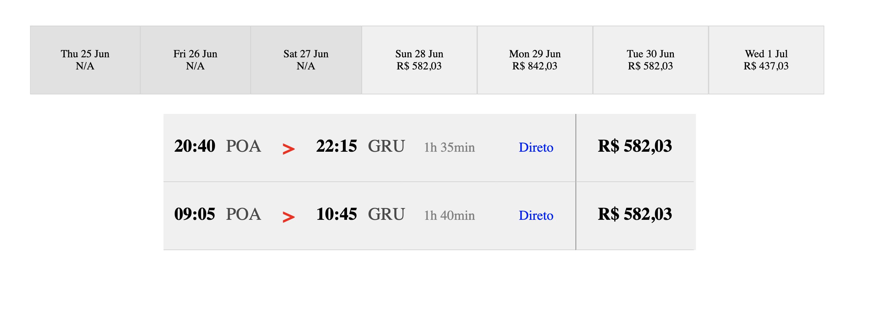

# Componente de Recomendações

A query que vamos utilizar neste capítulo será a de `recommendations`, que contém muitas mais informações que a de `best_prices`, mas será útil para compor os componentes faltantes. A baixo a query de `recommendations`:

```graphql
{
recommendations(departure: "2020-06-28", 
    origin: "POA", 
    destination: "GRU") {
    data{
      recommendedFlightCode
      flights {
        flightCode
        flightDuration
        stops
        arrival {
          cityName
          airportName
          airportCode
          dateTime
        }
        departure {
          cityName
          airportName
          airportCode
          dateTime
        }
        segments {
          flightNumber
          equipment {
            name
            code
          }
        }
        cabins {
          code
          displayPrice
          availabilityCount
        }
      }
    }
  }
}
```

Adicionamos esta query a função `fetch_gql` que executará ambas as queries simultaneamente. E já modificamos a struct `GqlField` para conter o campo `recommendations`:

```rust
pub fn fetch_gql() -> Value {
    json!({
        "query": "{
            recommendations(departure: \"2020-06-28\", 
                origin: \"POA\", 
                destination: \"GRU\") {
                data{
                recommendedFlightCode
                flights {
                    flightCode
                    flightDuration
                    stops
                    arrival {
                        cityName
                        airportName
                        airportCode
                        dateTime
                    }
                    departure {
                        cityName
                        airportName
                        airportCode
                        dateTime
                    }
                    segments {
                    flightNumber
                    equipment {
                        name
                        code
                    }
                    }
                    cabins {
                        code
                        displayPrice
                        availabilityCount
                    }
                }
                }
            }
            bestPrices(departure: \"2020-06-28\", origin: \"POA\", destination: \"GRU\") {
                bestPrices {
                    date
                    available
                    price {amount}
                }
             }
        }"
    })
}


#[derive(Serialize, Deserialize, Debug, PartialEq, Clone)]
#[serde(rename_all = "camelCase")]
pub struct GqlFields {
    best_prices: BestPrices,
    recommendations: Recommendations,
}
```

Esta query retorna o seguinte Json:

```json
{
  "data": {
    "recommendations": {
      "data": [
        {
          "recommendedFlightCode": "LA3068",
          "flights": [
            {
              "flightCode": "LA3068",
              "flightDuration": "PT1H35M",
              "stops": 0,
              "arrival": {
                "cityName": "São Paulo",
                "airportName": "Guarulhos Intl.",
                "airportCode": "GRU",
                "dateTime": "2020-06-28T22:15-03:00"
              },
              "departure": {
                "cityName": "Porto Alegre",
                "airportName": "Salgado Filho",
                "airportCode": "POA",
                "dateTime": "2020-06-28T20:40-03:00"
              },
              "segments": [
                {
                  "flightNumber": "3068",
                  "equipment": {
                    "name": "Airbus 320-200",
                    "code": "320"
                  }
                }
              ],
              "cabins": [
                {
                  "code": "Y",
                  "displayPrice": 582.03,
                  "availabilityCount": 33
                },
                {
                  "code": "W",
                  "displayPrice": 1072.03,
                  "availabilityCount": 9
                }
              ]
            },
            {
              "flightCode": "LA3297",
              "flightDuration": "PT1H40M",
              "stops": 0,
              "arrival": {
                "cityName": "São Paulo",
                "airportName": "Guarulhos Intl.",
                "airportCode": "GRU",
                "dateTime": "2020-06-28T10:45-03:00"
              },
              "departure": {
                "cityName": "Porto Alegre",
                "airportName": "Salgado Filho",
                "airportCode": "POA",
                "dateTime": "2020-06-28T09:05-03:00"
              },
              "segments": [
                {
                  "flightNumber": "3297",
                  "equipment": {
                    "name": "Airbus 320-200",
                    "code": "320"
                  }
                }
              ],
              "cabins": [
                {
                  "code": "Y",
                  "displayPrice": 842.03,
                  "availabilityCount": 1
                },
                {
                  "code": "W",
                  "displayPrice": 1137.03,
                  "availabilityCount": 4
                }
              ]
            }
          ]
        }
      ]
    }
  }
}
```

Ou seja, nosso backend retornará um campo `data`, que pode ser um array vazio, pois pode retornar sem voos. O campo data por sua vez, retornará uma estrutura de `RecommendedFLights` que é um vetor com o voo recomendado, `recommendedFlightCode`, e todos os possíveis voos em `flights`. No primeiro momento, vamos focar apenas a estrutura do seguinte Json:

```json
{
    "flightCode": "LA3068",
    "flightDuration": "PT1H35M",
    "stops": 0,
    "arrival": {
        "cityName": "São Paulo",
        "airportName": "Guarulhos Intl.",
        "airportCode": "GRU",
        "dateTime": "2020-06-28T22:15-03:00"
    },
    "departure": {
        "cityName": "Porto Alegre",
        "airportName": "Salgado Filho",
        "airportCode": "POA",
        "dateTime": "2020-06-28T20:40-03:00"
    },
}
```

## Modelando Recommendations

A  modelagem do domínio vai seguir o mesmo formato do capítulo anterior e da parte anterior, assim podemos resumir a modelagem de `Recommendations` inicialmente da seguinte forma:

```rust
use serde::{Deserialize, Serialize};

#[derive(Serialize, Deserialize, Debug, PartialEq, Clone)]
pub struct Recommendations {
    data: Vec<RecommendedFlight>
}

#[derive(Serialize, Deserialize, Debug, PartialEq, Clone)]
#[serde(rename_all = "camelCase")]
pub struct RecommendedFlight {
    recommended_flight_code: String,
    flights: Vec<Flight>
}

#[derive(Serialize, Deserialize, Debug, PartialEq, Clone)]
#[serde(rename_all = "camelCase")]
pub struct Flight {
    flight_code: String,
    flight_duration: String,
    stops: i32,
    arrival: OriginDestination,
    departure: OriginDestination,
    segments: Vec<Segment>
}

#[derive(Serialize, Deserialize, Debug, PartialEq, Clone)]
#[serde(rename_all = "camelCase")]
pub struct OriginDestination {
    city_name: String,
    airport_name: String,
    airport_code: String,
    date_time: String,
}

#[derive(Serialize, Deserialize, Debug, PartialEq, Clone)]
#[serde(rename_all = "camelCase")]
pub struct Segment { 
    flight_number: String,
    equipment: Equipment
}

#[derive(Serialize, Deserialize, Debug, PartialEq, Clone)]
pub struct Equipment { 
    name: String,
    code: String
}
```

Agora podemos começar a implementar o componente da struct `Recommendations`.

## Implementando a `view` para `Recommendations`

Para este componente vamos utilizar uma forma diferente de criação de `view`, pois vamos passar as propriedades do nível de superior para que está view gerencie elas. Isso nos permitirá alterar o estado da aplicação de dentro do nosso componente de `Recommendations`. Agora, na implementação da struct `GqlResponse` precisamos adicionar uma função que facilite acesso ao campo privado `recommendations`, fazemos isso com:

```rust
impl GqlResponse {
    pub fn best_prices(self) -> BestPrices {
        self.data.best_prices
    }

    pub fn recommendations(self) -> Recommendations {
        self.data.recommendations
    }
}
```

Com isso, podemos chamar a mesma estratégia que usamos com `best_prices` e chamar a função `view` de `Recommendations` dentro da `view` de `Airline`. Para podemos chamar dois componentes `Html` dentro de outro, vamos preciisar separar em várias `div`s, pois cada conjunto de tag permiite a utilização de apenas um `Html` do `yew`. fazemos isso modificandoa  função `view` de `app.rs`:

```rust
fn view(&self) -> Html {
    if self.fetching {
        html! {
            <div class="loading-margin">
                <div class="loader"></div>
            </div>
        } 
    } else {
        html! {
            <div class="body">
                { 
                    if let Some(data) = &self.graphql_response {
                        html!{<div>
                            <div> {data.clone().best_prices().view()} </div>
                            <div> { data.clone().recommendations().view() } </div>
                          </div> }
                    } else {
                        html!{
                            <p class="failed-fetch">
                                {"Failed to fetch"}
                            </p>
                        }
                    }
                }
            </div>
        }
    }
}
```

Agora precisamos definir a função ` view` para a struct `Recommendations`, que será invocada em `app.rs`:

```rust
impl Recommendations {
    pub fn view(&self) -> Html {
      html!{
          <div class="flight-container"> {
              self.data[0].clone().flights.into_iter()
              .map(|r|
                  html!{
                      <div class="flight"> 
                          {"Hello from flights"}
                      </div>
                  }
              )
              .collect::<Html>()
          }
          </div>}
    }
}
```

### Compondo a `view`

Anteriormente descrevemos a função `view` da seguinte forma:

```rust
pub fn view(&self) -> Html {
  html!{
      <div class="flight-container"> {
          self.data[0].clone().flights.into_iter()
          .map(|r|
              html!{
                  <div class="flight"> 
                      // ...
                  </div>
              }
          )
          .collect::<Html>()
      }
      </div>}
}
```

A primeira coisa que gostaria de salientar é a presenção do `clone` logo após acessarmos o vetor com `[0]`, isso se deve ao fato de que temos apenas a referência de um valor, que não vai nos possibilitar executar o `move` para a macro, conforme o erro a seguir:

```
  --> src/reccomendation.rs:74:17
   |
74 |                 self.data[0].flights.into_iter()
   |                 ^^^^^^^^^^^^^^^^^^^^ move occurs because value has type `std::vec::Vec<reccomendation::Flight>`, which does not implement the `Copy` trait
   |
```

A criação do `flight-container` é algo bastante simples, pois basta incluirmos a `div` dentro da macro `html!`, mas dentro do container precisamos iterar sobre cada um dos voos utilizando `self.data[0].clone().flights.into_iter()`. Note que o campo `data` poderia ser `Option` e neste caso deveriamos utilizar um `if let Some(flights)` para extrair valor de `Some(flights)`, ou poderia ser um vetor vazio, e neste caso seriia melhor utilizar a função `first` e aplicar um `match`. Uma vez que temos nosso `into_iter` podemos applicar um `map` que vai criar nossos `Htmls`, para depois colecionarmos em um `collect::<Html>()`. Nosso `map` começa com um `html!` que cria a div correspondete a todo o bloco com informações do voo, conforme a imagem a seguir:



O css para está parte é este:

```css

.flight-container {
  width: 70%;
  margin-top: 5rem;
  transform: translate(35%, 0%);
  background-color: #f1f0f0;
}

.flight {
  display: table-row;
  border: 1px solid lightgrey;
}

.flight-cell {
  padding: 2rem 1rem;
  display: table-cell;
  border-bottom: 1px solid lightgray;
}

.origins-destinations {
  width: 22rem;
  display: flex;
}

.arrow {
  font-size: 30px;
  font-weight: bold;
  color: red;
  margin-left: 2rem;
  margin-right: 2rem;
}

.origin-destination {
  font-size: 26px;
  display: flex;
}

.time {
  font-weight: bold;
  color: black;
}

.airport {
  color: rgb(75, 74, 74);
  margin-left: 1rem;
}

.duration {
  padding: 1rem 2rem;
  font-size: 20px;
  color: gray;
}

.stops {
  padding: 1rem 2rem;
  font-size: 20px;
  color: blue;
}

.price {
  font-size: 26px;
  font-weight: bold;
  padding: 1rem 2rem;
  margin-left: 1rem;
  border-left: 1px groove lightgray;
}
```

Assim, podemos começar a implementar cada uma das células que formam um voo. Fazemos isso utilizando várias `div`s com suas configurações definidas no CSS:

```rust
<div class="flight"> 
    <div class="flight-cell origins-destinations">
        <div class="origin-destination"> 
            <div class="time"> {{
                let date = Utc.datetime_from_str(&r.departure.date_time[..16],"%Y-%m-%dT%H:%M");
                date.unwrap().format("%H:%M").to_string()
            }} </div>
            <div class="airport"> {r.departure.airport_code} </div>
        </div>
        <div class="arrow">{">"}</div>
        <div class="origin-destination">
            <div class="time"> {{
                let date = Utc.datetime_from_str(&r.arrival.date_time[..16],"%Y-%m-%dT%H:%M");
                date.unwrap().format("%H:%M").to_string()
            }} </div>
            <div class="airport"> {r.arrival.airport_code} </div>
        </div>
    </div>
    <div class="flight-cell duration"> {
        r.flight_duration.replace("PT","").replace("H", "h ").replace("M", "min")
    } </div>
    <div class="flight-cell stops"> {
        if r.stops == 0 {
            html!{<p>{"Direto"}</p>}
        } else {
            html!{<p>{r.stops.to_string()}</p>}
        }   
    } </div>
    <div class="flight-cell price"> {"R$ 582,03"}</div>
</div>
```

A primeira célula, `origins-destinations`, possui três grandes campos, origem, seta e destino. Origem e destino são iguais em organizacão, mudando apenas o campo para acessar as iinformações de oirgem, `departuure`, e de destino, `arrival`. Existe uma pegadiinha no tiipo `date_time`, que torna parsear ele um pouco complicado para um  parser normal, pois ele não apresenta o campo de  segundos no horário, mas apresenta o timezone `-3:00`. A forma como podemos lidar com isso é enviando um formater que vai parsear apenas a parte da String de `dataTime` que temos controle, `"%Y-%m-%dT%H:%M"`, ou seja, os 16 primeiros caracteres, por isso do slice `r.departure.date_time[..16]`.

Nos campos faltantes, vamos aplicar algumas funções para alterar seu valor. Por exemplo, o campo `flight_duration` aparece no formato `PT1H40M`, mas queremos exibir o formato `1h 40min`, por isso removemos `PT`, fazemos o replace de `H` por `h ` e modificamos `M` para `min`. Quanto ao campo `stops`, a úncia coisa que precisamos garantir é que se a quantidade for zero, vamos escrever `Direto`, caso não for, mostramos quantas escalas são. O preço veremos a seguir.

## Introduzindo cabines

O objetivo de introduzir `cabins` é podermos exibir diferentes preços para diferentes conjuntos de Voos. No exemplo que estamos utilizando possuimos dois tipos de `cabin`, a `Y` que corresponde a classe `economy` e a `W` que corresponde a `premium economy`. Para utilizarmos `cabins` vamos precisar criar o modelo para `cabins` dentro da struct `Flight`. O Json correspondente é:

```json
{"cabins": [
    {
      "code": "Y",
      "displayPrice": 842.03,
      "availabilityCount": 1
    },
    {
      "code": "W",
      "displayPrice": 1137.03,
      "availabilityCount": 4
    }
  ]
}
```

Com isso, podemos notar que o campo `cabins` é bastante simples, pois é composto por um vetor de `Cabin` que pode ser definida da seguinte forma:

```rust
#[derive(Properties, Serialize, Deserialize, Debug, PartialEq, Clone)]
#[serde(rename_all = "camelCase")]
pub struct Cabin { 
    code: String,
    display_price: f64,
    availability_count: i32
}
```

Agora precisamos filtrar os voos pela `Cabin` com `code` igual a `Y` para exibirmos o `display_price`, caso a contagem de assentos, `availability_count`, seja maior que zero. Para fazermos isso precisamos adicionar o campo de filtro no estado de `Airline`. Isso pode ser feito da seguinte forma:

```rust
pub struct Airline {
    // ...
    graphql_response: Option<GqlResponse>,
    filter_cabin: String,
}
```

E adicionar este campo nos obriga a adicionar um valor padrão na função `create` de `Airline`:

```rust
fn create(_: Self::Properties, link: ComponentLink<Self>) -> Self {
    Airline {
        fetch: FetchService::new(),
        link: link,
        fetch_task: None,
        fetching: true,
        graphql_url: "http://localhost:4000/graphql".to_string(),
        graphql_response: None,
        filter_cabin: String::from("Y"),
    }
}
```

Com isso, precisamos definir uma mensagem para executar `updates`. Essa mensagem definiremos como `Cabin(String)`:

```rust
pub enum Msg {
    FetchGql(Option<Text>),
    Fetching(bool),
    Cabin(String)
}
```

E precisamos definir como o update vai se comportar quando receber a mensagem `Cabin`:

```rust
fn update(&mut self, msg: Self::Message) -> ShouldRender {
  match msg {
      Msg::FetchGql(data) => {
          // ...
      },
      Msg::Fetching(fetch) => {
          self.fetching = fetch;
      },
      Msg::Cabin(c) => {
          self.filter_cabin = c
      }
  }
  true
}
```

Assim, nosso `update` vai atualizar o campo `filter_cabin` com o valor recebido dentro da mensagem `Cabin`. O próximo passo seria enviar para a função `view` de `Recommendations` o `ComponentLink<Airline>` e o `filter_cabin` como referências emprestadas, fazemos isso utilizando o `&`:

```rust
fn view(&self) -> Html {
    if self.fetching {
       // ...
    } else {
        html! {
            <div class="body">
                { 
                    if let Some(data) = &self.graphql_response {
                        html!{<div>
                            <div> {data.clone().best_prices().view()} </div>
                            <div> { data.clone().recommendations().view(&self.link, 
                                        &self.filter_cabin) } </div>
                          </div> }
                    } else {
                        // ...
                    }
                }
            </div>
        }
    }
}
```

Agora que sabemos o que devemos passar para a `view`  de `Recommendations` podemos atualizar a funcão com:

```rust
use crate::app::{Airline, Msg};
// ...


impl Recommendations {
    pub fn view(&self, link: &ComponentLink<Airline>, filter_cabin: &str) -> Html {
        html!{
            <div>
                <div class="cabins">
                    <div class="cabin" onclick=link.callback(move |_| Msg::Cabin("Y".to_string()))>
                        {"Economy"}</div>
                    <div class="cabin" onclick=link.callback(move |_| Msg::Cabin("W".to_string()))>
                        {"Premium Economy"}</div>
                </div>
                <div class="flight-container"> {
                    self.data[0].clone().flights.into_iter()
                    .map(|r|
                        html!{
                            <div class="flight"> 
                                <div class="flight-cell origins-destinations">
                                    <div class="origin-destination"> 
                                        <div class="time"> {{
                                            let date = Utc.datetime_from_str(&r.departure.date_time[..16],"%Y-%m-%dT%H:%M");
                                            date.unwrap().format("%H:%M").to_string()
                                        }} </div>
                                        <div class="airport"> {r.departure.airport_code} </div>
                                    </div>
                                    <div class="arrow">{">"}</div>
                                    <div class="origin-destination">
                                        <div class="time"> {{
                                            let date = Utc.datetime_from_str(&r.arrival.date_time[..16],"%Y-%m-%dT%H:%M");
                                            date.unwrap().format("%H:%M").to_string()
                                        }} </div>
                                        <div class="airport"> {r.arrival.airport_code} </div>
                                    </div>
                                </div>
                                <div class="flight-cell duration"> {
                                    r.flight_duration.replace("PT","").replace("H", "h ").replace("M", "min")
                                } </div>
                                <div class="flight-cell stops"> {
                                    if r.stops == 0 {
                                        html!{<p>{"Direto"}</p>}
                                    } else {
                                        html!{<p>{r.stops.to_string()}</p>}
                                    }   
                                } </div>
                                <div class="flight-cell price"> {{
                                    let cabin = r.cabins.into_iter()
                                        .filter(|c| c.availability_count > 0 && &c.code == filter_cabin)
                                        .collect::<Vec<Cabin>>();
                                    match cabin.first() {
                                        Some(c) => format!("R$ {:?}", c.display_price),
                                        None => String::from("N/A")
                                    }
                                }}</div>
                            </div>
                        }
                    )
                    .collect::<Html>()
                }
                </div>
            </div>
        }
    }
}
```

Os estilos do código anterior são:

```css
.cabins {
  text-align: center;
  vertical-align: middle;
  color: rgb(110, 110, 110);
  display: table-row;
  transform: translate(195%, 185%);
  font-size: 20px;
}

.cabin {
  display: table-cell;
  border: 1px solid gray;
  padding: 9px 12px;
}
```

A primeira mudança que vamos entender é a adição do `display_price` para a `Cabin`:

```rust
<div class="flight-cell price"> {{
    let cabin = r.cabins.into_iter()
        .filter(|c| c.availability_count > 0 && &c.code == filter_cabin)
        .collect::<Vec<Cabin>>();
    match cabin.first() {
        Some(c) => format!("R$ {:?}", c.display_price),
        None => String::from("N/A")
    }
}}</div>
```

Iteramos sobre o valor de `cabins` com `r.cabins.into_iter()` que nos permite aplicar um `filter` para garantir que os voos estão disponíveis, `c.availability_count > 0` e para garantir q o código da `cabin`, `c.code`, é igiual ao `filter_cabin` que enviamos, `&c.code == filter_cabin`. Depois, coletamos os calores filtrados com `.collect::<Vec<Cabin>>()`. Este vetor de `Cabin` deve conter no máximo um elemento, assim aplicar um `first` é uma forma segura de garantir que não vamos perder valores. Aplicando um `match` em `abin.first()` lidamos com o fato de que podemos não ter uma `cabin` disponível para aquelec código, retornando `String::from("N/A")`. Para o caso de termos um `Some` com valor de `cabin` executamos um `format` para disponibilizar o valor da passagem, `Some(c) => format!("R$ {:?}", c.display_price)`.

O próximo passo é criar os `links` de `callbacks` que alterem o estado da aplicação:

```rust
<div class="cabins">
    <div class="cabin" onclick=link.callback(move |_| Msg::Cabin("Y".to_string()))>
        {"Economy"}</div>
    <div class="cabin" onclick=link.callback(move |_| Msg::Cabin("W".to_string()))>
        {"Premium Economy"}</div>
</div>
```

Criamos uma `div` que possui as duas cabines que conhecemos, `Economy` e `Premium Economy`, dentro de suas prórpias `div`s. Cada uma das `dvi`s  vai ter um `callback` com JavScript  para alterar o estado de `fiilter_cabin`. Fazemos isso adicionando `onclick=link.callback(move |_| Msg::Cabin("Y".to_string()))` a `div` de `Economy` e `onclick=link.callback(move |_| Msg::Cabin("W".to_string()))` a `div` de `Premium Economy`.

Nosso próximo passo é defiiniir uma forma de receber os parâmetros da query GraphQL via rota da URL e que possamos atualizar esses dados de forma a executar um novo request com os novos parâmetros.
